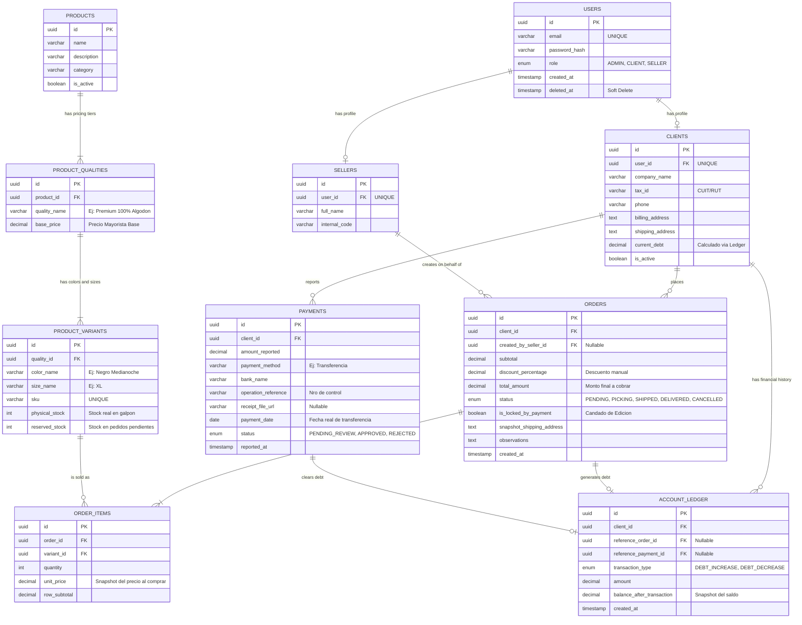
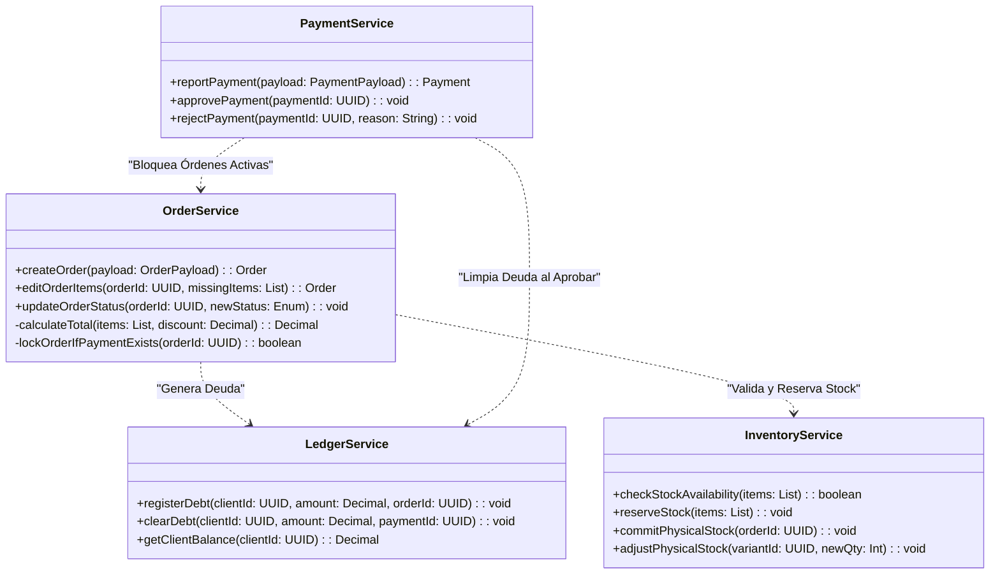

# Arquitectura Backend & Base de Datos

Este documento define la infraestructura de datos, las reglas de comunicación (API) y la lógica de negocio central de Vantra B2B. Es la fuente de verdad estricta para el equipo de desarrollo Backend. La arquitectura prioriza la integridad transaccional (ACID), el manejo de concurrencia para el inventario y la inmutabilidad de los registros financieros.

---

## 🗄️ 3.1. Modelo Entidad-Relación (ERD)

El diseño de la base de datos relacional (SQL) de Vantra B2B no es un modelo plano estándar. Está diseñado bajo tres patrones arquitectónicos empresariales:

1. **Soft-Allocation (Reserva de Stock):** Separación estricta entre el stock físico (en el galpón) y el stock reservado (en carritos/pedidos pendientes) para evitar colisiones cuando múltiples clientes compran el mismo SKU.
2. **Append-Only Ledger (Libro Mayor):** La cuenta corriente de los clientes no se maneja actualizando un campo `saldo`. Se utiliza un registro inmutable donde cada orden suma deuda y cada pago la resta, garantizando auditoría financiera a prueba de fallos.
3. **Aplanamiento de Variantes:** La matriz tridimensional (Calidad > Color > Talle) se aplana en la base de datos en la tabla `PRODUCT_VARIANTS` para evitar queries (JOINs) costosos y mejorar el tiempo de respuesta (Latency).

**Diagrama de Arquitectura de Datos:***(El siguiente diagrama visualiza las entidades, relaciones (PK/FK) y tipos de datos estrictos).*



**Diccionario de Datos y Reglas de Tablas:***(Explicación detallada de cada campo crítico, constraints y comportamientos lógicos de la base de datos).*

- **Ledger Inmutable:** La tabla `ACCOUNT_LEDGER` funciona bajo la regla estricta de *Append-Only*. Está prohibido hacer `UPDATE` o `DELETE`. Para corregir un error financiero, se debe emitir una transacción compensatoria.
- **Snapshot de Precios:** `ORDER_ITEMS.unit_price` guarda el valor exacto de la mercadería en el milisegundo en que se confirmó la orden. Si los precios del catálogo suben al día siguiente, el historial contable no se rompe.
- **Candado de Edición:** `ORDERS.is_locked_by_payment` se vuelve `TRUE` automáticamente si el cliente reporta un pago mientras la orden sigue en preparación, bloqueando métodos PUT/PATCH desde el Frontend.

---

## 📝 3.2. Contratos de API (JSON Payloads)

Esta sección define el límite de comunicación entre el Frontend (React) y el Backend (Node/Python/Java). Para mantener el sistema rápido y delegar el procesamiento al cliente, se han establecido formatos de datos (Payloads) estrictos, especialmente para la carga de la **Matriz de Pedidos**.

### A. Endpoint: Detalle de Producto y Matriz (Lectura)

- **Ruta:** `GET /api/products/{id}`
- **Propósito:** Proveer al Frontend toda la información necesaria para renderizar la vista de compra tridimensional.
- **Estructura:** El Backend es responsable de enviar la información **agrupada por Calidad**. Esto permite al Frontend generar dinámicamente las pestañas (Tabs) de calidad, y dentro de ellas, iterar sobre las filas (Colores) y columnas (Talles) sin tener que procesar datos crudos.

```jsx
{
  "product_id": "REM-001",
  "name": "Remera Básica Oversize",
  "qualities": [
    {
      "quality_id": "Q-PREMIUM",
      "quality_name": "Premium Algodón 100%",
      "base_price": 15000,
      "matrix": [
        {
          "color_name": "Negro Medianoche",
          "sizes": [
            { "size": "S", "stock": 150 },
            { "size": "M", "stock": 85 },
            { "size": "L", "stock": 0 } 
          ]
        }
      ]
    },
    {
      "quality_id": "Q-ECONOMIC",
      "quality_name": "Cardado Económico",
      "base_price": 9500,
      "matrix": [
        {
          "color_name": "Gris Jaspeado",
          "sizes": [
            { "size": "M", "stock": 500 },
            { "size": "L", "stock": 300 }
          ]
        }
      ]
    }
  ]
}
```

### B. Endpoint: Confirmación de Orden (Escritura)

- **Ruta:** `POST /api/orders`
- **Propósito:** Recibir la orden de compra confirmada por el usuario (o por el vendedor delegado) y procesar la transacción financiera y de inventario.
- **Estructura (Data Flattening):** El Frontend **no** envía la matriz entera. Es responsabilidad del cliente (React) filtrar todas las celdas con valor `0`, aplanar la estructura tridimensional y enviar un array unidimensional (lista plana) únicamente con los SKUs/Variantes que el usuario efectivamente va a comprar, junto con la información de trazabilidad (quién creó la orden y si hay descuentos).

```jsx
{
  "client_id": "CLI-8829",
  "created_by_seller_id": "VEND-102", 
  "manual_discount_percentage": 10,
  "observations": "Enviar por expreso a Córdoba",
  "items": [
    {
      "product_id": "REM-001",
      "quality_id": "Q-PREMIUM",
      "color": "Negro Medianoche",
      "size": "M",
      "quantity": 50,
      "unit_price": 15000
    },
    {
      "product_id": "REM-001",
      "quality_id": "Q-ECONOMIC",
      "color": "Gris Jaspeado",
      "size": "L",
      "quantity": 120,
      "unit_price": 9500
    }
  ]
}
```

---

## 🧠 3.3. Lógica de Negocio y Arquitectura UML

La capa de servicios del Backend opera usando el patrón MVC/Service Layer. El diagrama a continuación detalla las Clases y Métodos críticos que el equipo Backend debe implementar para gestionar la concurrencia, el stock y la cuenta corriente.



### Funciones Críticas del Backend (Casos de Uso)

- `createOrder()`: Debe ejecutarse como una Transacción ACID. Llama a `checkStockAvailability()`; si hay stock, llama a `reserveStock()` y luego a `registerDebt()`. Si cualquiera falla, hace *Rollback* completo.
- `editOrderItems()`: Si Héctor saca prendas faltantes de una orden en estado *Picking*, esta función debe devolver el stock reservado a la base de datos y emitir una transacción de reajuste en el `LedgerService` para achicar la deuda del cliente.
- `approvePayment()`: Cambia el estado del pago a `APPROVED` y dispara `clearDebt()` para asentar la reducción de saldo en el Libro Mayor.