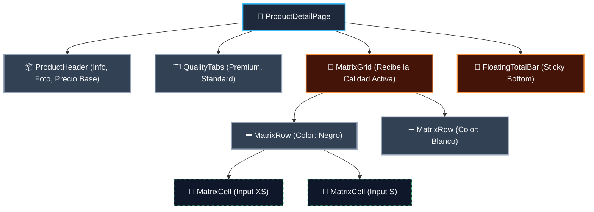
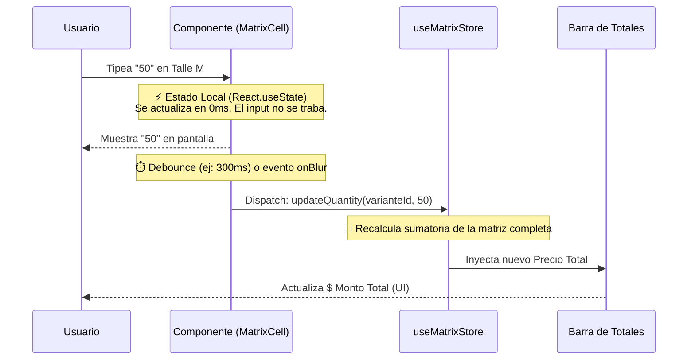
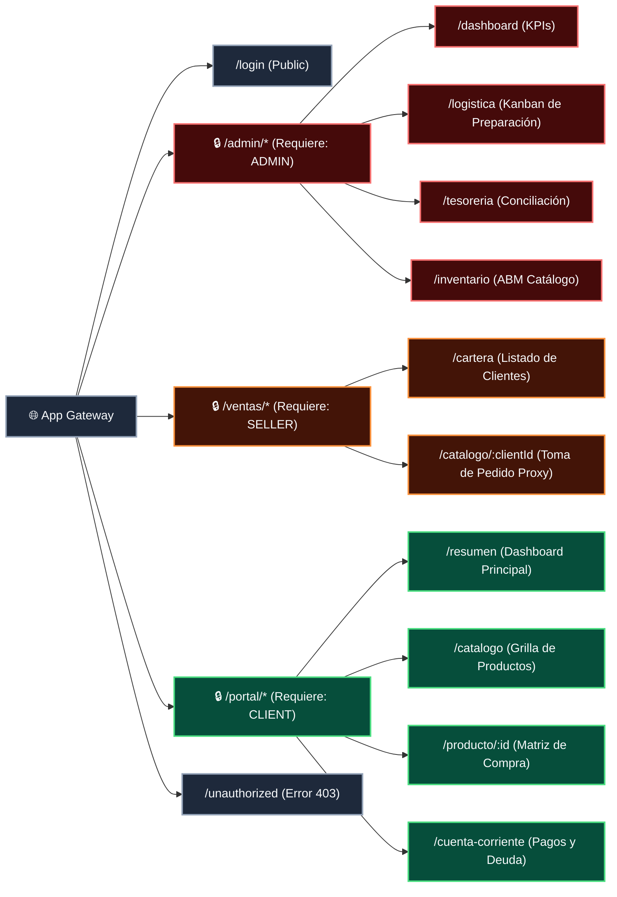

# Arquitectura Frontend

Este documento define las bases técnicas, la estructura de carpetas y los patrones de renderizado de la aplicación cliente (Single Page Application). El objetivo de esta arquitectura es mantener un código altamente escalable, componentes reutilizables y un rendimiento (Zero-Latency) impecable en vistas densas de datos como el Catálogo B2B y la Matriz de Pedidos.

# 🛠️ Stack Tecnológico Base

- **Librería Core:** React (18+) con Vite (como bundler para máxima velocidad en desarrollo).
- **Estilos:** Tailwind CSS (Utility-first, elimina la necesidad de escribir archivos CSS o lidiar con selectores globales).
- **Sistema de Componentes (UI Kit):** `shadcn/ui` + Radix UI. Provee componentes accesibles y con diseño premium (headless) que copiamos directamente a nuestro código para tener control total, evitando la rigidez de librerías como Material UI.
- **Íconos:** Lucide React (Ligeros, vectoriales y consistentes con la estética minimalista).
- **Animaciones:** Framer Motion (Utilizado exclusivamente para Skeletons, despliegue del Drawer de Pagos y el montaje de la tabla Kanban, minimizando el reflow del DOM).

---

# ⚛️ 1. Estructura de Componentes y Árbol de Directorios

Para evitar el clásico "spaghetti code" de React donde todo termina en la carpeta `/components`, vamos a utilizar una arquitectura basada en **Feature-Sliced Design (Diseño por Funcionalidades)** adaptada.

### Estructura de Carpetas del Proyecto (`/src`)

```jsx
src/
├── assets/             # Imágenes estáticas, logos y fuentes (Plus Jakarta Sans).
├── components/
│   ├── ui/             # "Piezas de Lego". Componentes puros de shadcn (Button, Input, Table, Dialog, Toast).
│   ├── layout/         # Envoltorios globales (Sidebar, Navbar, MainLayout).
│   └── shared/         # Componentes de negocio reutilizables (ClientDebtBadge, StatusPill).
├── features/           # El código agrupado por módulo de negocio (¡La clave de la escalabilidad!)
│   ├── catalog/        # Componentes exclusivos del catálogo y la matriz de compra.
│   ├── kanban/         # Lógica visual y componentes de las tarjetas de preparación.
│   └── treasury/       # Visor de PDF, formularios de reporte de pagos.
├── hooks/              # Custom Hooks globales (useAuth, useMediaQuery).
├── lib/                # Utilidades puras de JS (formatear moneda `formatARS()`, clsx/tailwind-merge).
├── pages/              # Las vistas finales que enruta React Router (Ej: /admin/dashboard).
├── store/              # Gestión de estado global (Acá vivirá Zustand, ver sección 4.2).
└── types/              # Interfaces de TypeScript (Si usamos TS, acá van los contratos JSON).
```

### Arquitectura de Renderizado: El Componente de la Matriz Tridimensional

El mayor riesgo de performance en React es que, si tipeas un número en un input de la matriz, toda la tabla de 300 celdas se vuelva a renderizar, provocando *lag*. Para solucionarlo, dividimos la responsabilidad.

El siguiente diagrama muestra el Árbol de Componentes exacto para la pantalla de "Matriz de Pedidos" (la más compleja del sistema):



### Reglas de Renderizado (Performance Guardrails)

1. **Delegación de Estado:** El componente padre (`ProductDetailPage`) NO guarda el estado de cada input. Si lo hiciera, escribir un "5" en la talla XL haría que se re-dibujen la foto, el header y todas las demás filas.
2. **React.memo en Filas:** Cada `MatrixRow` estará envuelto en `React.memo()`. Esto le dice al navegador: *"Si el usuario tipeó en la fila Blanca, no gastes CPU en re-dibujar la fila Negra porque sus datos no cambiaron"*.
3. **Control local vs global:** El `MatrixCell` (Input) manejará su propio estado local mientras el usuario tipea (para que el cursor sea fluido) y, mediante un efecto o un *onBlur/onChange* *debounced*, enviará el valor al Estado Global del carrito.

# 🔁 2. Gestión de Estado (State Management)

El manejo de datos en memoria (Frontend State) en Vantra B2B requiere una estrategia quirúrgica. Tenemos que manejar datos persistentes (la sesión del usuario), datos semi-persistentes (el carrito B2B) y datos efímeros de alta frecuencia (los inputs de la matriz tridimensional que cambian en milisegundos).

Para lograr esto con **Zero-Latency** (cero tirones visuales al escribir), la arquitectura utilizará **Zustand** como motor de estado global, dividido en "Stores" (Almacenes) modulares por dominio.

### A. Ecosistema de Stores (Zustand)

No meteremos todo en un solo mega-archivo. Dividimos la responsabilidad:

1. **`useAuthStore`:** Maneja el token JWT, el ID del cliente actual, el rol (`ADMIN`, `CLIENT`, `SELLER`) y, si hay un vendedor logueado, a qué cliente está "impersonando" (Proxy mode).
2. **`useCartStore`:** Es la memoria del pedido. Almacena la data plana (el JSON que finalmente viajará por el POST). Contiene el array de `items`, el subtotal global, el `discount_percentage` (solo si es vendedor) y los métodos `addItem()`, `removeItem()` y `clearCart()`.
3. **`useMatrixStore` (Estado Efímero):** Maneja exclusivamente la página del producto que el usuario está viendo *ahora mismo*. Sabe qué pestaña de "Calidad" está activa y qué cantidades se ingresaron en la grilla antes de mandarlas al carrito definitivo.

### B. Patrón de Rendimiento en la Matriz (El "Secreto" del CTO)

El mayor desafío técnico de la UI es tipear en una celda (ej. Talle M, Color Negro) e instantáneamente ver cómo se actualiza el "Subtotal de Fila" y la "Barra Flotante de Total" sin que el teclado del usuario se trabe.

Para resolverlo, aplicamos el **Patrón de Sincronización Diferida (Local-to-Global Sync)**:



**Reglas de Implementación en Código:**

- **Inputs Nativos Aislados:** El componente `<MatrixCell />` usa su propio `useState` local para que el valor numérico cambie instantáneamente en el DOM.
- **El puente al Estado Global:** Solo cuando el usuario termina de tipear (evento `onBlur` al salir del input) o después de un *debounce* de 300 milisegundos, el componente avisa a Zustand (`useMatrixStore.getState().updateQuantity(...)`).
- **Reactividad Granular:** En Zustand, la barra inferior (`FloatingTotalBar`) se suscribe *únicamente* a la variable `totalAmount`. Esto asegura que cuando Zustand recalcula la plata, React solo re-dibuja esa barrita inferior y **no vuelve a renderizar los 300 inputs de la tabla**.

### C. Mutaciones de Servidor (Server State)

Para las llamadas a la API (GET productos, POST órdenes), no guardaremos esa información asíncrona en Zustand. Utilizaremos **TanStack Query (React Query)**.

- **Por qué:** React Query maneja automáticamente los estados de *Loading*, *Error* y la cache del navegador. Esto nos permite mostrar los *Skeletons* de forma casi automática mientras esperamos que el backend de Héctor nos devuelva el catálogo, y hace *re-fetching* silencioso si el usuario cambia de pestaña y vuelve.

# 🛣️ 3. Enrutamiento (Router) y Protección de Vistas

Este documento define el árbol de navegación (URLs) de la Single Page Application (SPA) y las políticas de control de acceso basado en roles (RBAC) en el Frontend. El objetivo es garantizar que la experiencia sea fluida (sin recargas de página) y que ningún usuario pueda acceder a pantallas o módulos para los cuales no tiene permisos, interceptando la navegación a nivel de componente.

## 🗺️ 3.1. Mapa de Rutas (URL Tree)

La aplicación utiliza un único dominio, pero segmenta el entorno virtualmente a través de prefijos en la URL (`/admin`, `/ventas`, `/portal`). Esto permite tener layouts (menús laterales y cabeceras) completamente distintos para Héctor (Admin), Martín (Vendedor) y un Cliente Mayorista.

El siguiente diagrama ilustra el árbol de enrutamiento y los middlewares de seguridad que protegen cada rama:



## 🛡️ 3.2. Implementación de Seguridad (Route Guards)

En React, el Frontend es código público que corre en el navegador del usuario. Un cliente "pillo" podría tipear `/admin/tesoreria` en la barra de direcciones. Para evitar que la vista se renderice e intente llamar a APIs prohibidas (que el Backend rechazaría de todos modos, pero generaría errores feos en pantalla), implementamos el patrón de **Componentes Envolventes (Wrappers)**.

### El Componente `<ProtectedRoute />`

Toda ruta privada no se declara suelta, sino que se envuelve en un componente de seguridad que consulta el estado global de autenticación (`useAuthStore` definido en la sección anterior).

**Lógica de Intercepción (Flujo exacto):**

1. El usuario navega a `/admin/inventario`.
2. El enrutador invoca a `<ProtectedRoute allowedRoles={['ADMIN']}>`.
3. El componente lee el JWT o la sesión en memoria.
4. **Escenario A (No está logueado):** Redirección forzada y silenciosa a `/login`.
5. **Escenario B (Es un Cliente):** Redirección forzada a la vista `/unauthorized` o directamente a su `/portal/resumen` para evitar fugas de información.
6. **Escenario C (Es Héctor - ADMIN):** El componente devuelve `children` y la pantalla de inventario se monta correctamente.

---

## 🔀 3.3. Rutas Dinámicas y Modo "Proxy" (Vendedor)

Una de las particularidades más complejas del enrutamiento de Vantra B2B es el rol del Vendedor. El vendedor no compra para sí mismo, sino en nombre de un cliente.

Para resolver esto a nivel de URL sin duplicar código, utilizamos **Rutas Dinámicas parametrizadas**:

- Cuando el vendedor selecciona al "Cliente SRL" en su cartera, el Router lo navega a: `/ventas/catalogo/CLI-8829`.
- El componente del catálogo extrae ese `clientId` de la URL (usando `useParams()` de React Router).
- Ese ID se inyecta en el estado global (`useAuthStore.setImpersonatedClient('CLI-8829')`).
- A partir de ahí, todos los endpoints de React Query que busquen el saldo o disparen la orden de compra en esa sesión, usarán ese ID en lugar del ID del vendedor.

## 🏎️ 3.4. Code Splitting (Carga Perezosa)

Para que el login inicial cargue en milisegundos, no podemos obligar al navegador a descargar todo el código del Kanban Logístico si el que está entrando es un Cliente.
Utilizaremos `React.lazy()` y `Suspense`. El código de la rama `/admin` solo se descarga (Chunking) si el usuario efectivamente navega hacia esa ruta y pasa el Route Guard.